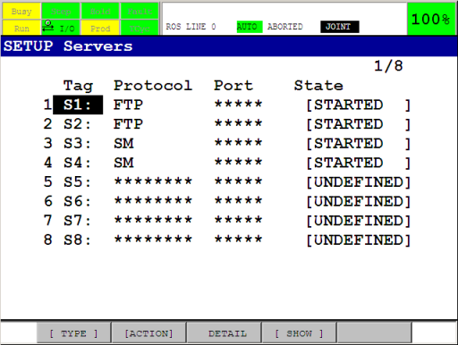

.. keywords = Fanuc, Roboguide, Industrial, R-30iA, R-J3iC, KAREL, TP

Configuration of the driver
===========================

.. important::

   This tutorial assumes familiarity with Fanuc controller cabinets, the Teach Pendant (iPendant) and the Roboguide environment. For more information on any of the steps in this tutorial, consult the documentation on these subjects provided by Fanuc Robotics.

Overview
--------

In the :doc:`previous chapter <installation>` the ROS-Industrial driver components were installed on the robot controller. Now, before they can be started, some additional configuration of both the controller and the programs is required.

Server Tags
-----------

The ``ros_state`` and ``ros_relay`` programs make use of the *User Socket Messaging* (USM) software option, and expect two *Server Tags* to be available. By default ROS-Industrial uses 3 and 4, and they must be properly configured before use (1 and 2 are typically used by the built-in FTP server).

To check Tag availability and status, open the *Host Comm* setup screen (``Menu → SETUP → Host Comm``), and then go to the *SETUP Servers* listing using ``[SHOW] → Servers``. Pick two available Tags and write down their numbers (we'll need those later, when updating the configuration of the ROS-Industrial programs). Finally, make sure the Tags are configured as follows (the comment is not required):

Go back to the *SETUP Servers* listing and verify that the chosen Tags are in state ``STARTED``. If not, start each tag with ``[ACTION] → DEFINE``, then ``[ACTION] → START``, or restart the control cabinet. Make sure they have been started by re-opening the *SETUP Servers* screen (if necessary) and checking the ``Current State`` of both tags: it should say ``STARTED``.

For more information on User Socket Messaging and tags, see Chapter 11 and Section 11.3.2 of the relevant Karel Reference Manual [#krl_refman]_.

.. _sec-flags-and-registers:

Flags and Registers
-------------------

The ``ros_relay`` and ``ros_movesm`` programs make use of several registers and flags. By default, flags 1 & 2, integer registers 1 & 2 and position registers 1 & 2 are used. Make sure these are not used by any other programs that may be running concurrently with the ROS-Industrial programs on the controller [#flagsregs]_. If any of the flags or registers are currently being used, find some alternatives, and note their numbers. We'll use those in the next section.

All flags and integer registers can be used, but the position registers need two registers at consecutive locations (ie: ``PR[34]`` **and** ``PR[35]``).

.. tip::

   It is good practice to set a descriptive comment on the used flags and registers. This will make it easier later in this tutorial to verify that the correct flags and registers are used in the ROS-Industrial programs.

Maximum Concurrent Task Number
------------------------------

By default, the controller can only run a small number of concurrent user tasks, which could prevent the ROS-Industrial programs from starting. The currently configured number of allowed tasks is stored in the ``$SCR.$MAXNUMTASK`` system variable. Any number above 3 should be enough to start the KAREL programs, but higher may be necessary if the controller also starts other tasks.

.. caution::

   Changing system variables can result in an unstable or non-functioning system. Before making any changes, be sure to have a recent backup of the controller and consult with the robot operator in case you are unsure about any of these steps.

The current value can be found in the *SYSTEM Variables* screen (``Menu → NEXT → SYSTEM → Variables``). Scroll down to ``$SCR``, press ``ENTER``, then scroll to the ``$MAXNUMTASK`` entry.

To change the number, start the controller using a *controlled start*. Then open the *Program Limits* screen using ``Menu → NEXT → PROGRAM SETUP``. Then input a new value for the ``User Tasks`` entry. Now restart the controller using ``Fctn → START (COLD)``.

Refer to Section B.1.3 of the relevant Fanuc Operator's Manual for the tool package installed on the robot controller for more information on how to perform a *controlled start* [#opman]_.

Payload, Tool and User Frames (optional)
----------------------------------------

The following system settings may influence the behaviour of the robot when used with ROS-Industrial, however for basic operation, changes to these settings are not absolutely necessary.

.. caution::

   Changes to payload schedules and / or selected user and tool frames may not be apparent to other users of the robot and can potentially influence all other programs on the controller. Be sure to have a recent backup and / or write down their current values in order to be able to restore them if necessary.

For the payload schedule, input the correct information using the TP on the *Motion/Payload Set* setup screen (``Menu → NEXT → SYSTEM → Motion``). Be sure to configure *and* select the correct schedule. For more information, see Section 9.14 in the the relevant Fanuc Operator's Manual for the tool package installed on the robot controller [#opman]_.

Configured user and tool frames are (currently) ignored in the ROS Industrial nodes as motion trajectories are specified in joint space. This is also true for robot state reporting. The use of a user frame coincident with the world frame is however recommended as it helps in debugging and verifying the motion of the arm and the location of the TCP using the `tf <http://wiki.ros.org/tf>`_ tools available in ROS.

Tool frames configured at the robot controller side are also not taken into account by the ROS motion planners, as tools should be represented by an appropriate URDF. The combination of the arm and tool URDFs provides similar information to the planning libraries (see also the `Create a URDF for an Industrial Robot <http://wiki.ros.org/Industrial/Tutorials/Create%20a%20URDF%20for%20an%20Industrial%20Robot>`_ tutorial). It is however recommended to manually verify the correct tool frame setup on the TP, as the robot controller also uses this information.

Go to ``Menu → Setup → Frames`` and use the ``[OTHER]`` function key to switch between the Tool and User Frame listings. Disable the user frame: use the ``Next`` button, then press the ``CLRIND`` function key (alternatively, configure an all zeros user frame) [#uframes]_. Verify the tool frame setup in the *Tool Frame* screen.

For more information on user and tool frame setup, see Section 3.9 in the relevant Fanuc Operator's Manual for the tool package installed on the robot controller [#opman]_.

KAREL and TPE Programs
----------------------

With the information gathered in the previous sections, we can now proceed to configure the KAREL and TP programs on the controller. Even if you do not have to change any of the defaults, you still need to follow the steps in this section.

KAREL Programs
^^^^^^^^^^^^^^

The default configuration of the ``ros_relay`` program is shown in the :ref:`ros_relay config table` table. :ref:`ros_state config table` documents the default configuration of the ``ros_state`` program.

.. csv-table:: Configuration of ros_relay
   :header: "Name", "Type", "Default", "Unit", "Description"
   :widths: 15, 10, 10, 10, 55
   :name: ros_relay config table

   "checked", "boolean", "False", "", "Configuration has been completed by user"
   "f_msm_drdy", "integer", "2", "", "movesm i'face: 'data ready' signal flag"
   "f_msm_rdy", "integer", "1", "", "movesm i'face: 'ready/ack' signal flag"
   "loop_hz", "integer", "40", "Hz", "Main loop update rate"
   "move_cnt", "integer", "50", "%", "CNT to set with each joint motion instruction"
   "move_speed", "integer", "20", "%", "Joint speed to set for all trajectory points"
   "pr_move", "integer", "1", "", "movesm i'face: position register for next trajectory point"
   "r_move_cnt", "integer", "2", "", "movesm i'face: integer register for CNT value"
   "r_move_spd", "integer", "1", "", "movesm i'face: integer register for motion speed"
   "s_tag_nr", "integer", "4", "", "Index of the Server Tag to use"
   "s_tcp_nr", "integer", "11000", "", "TCP port to listen on"
   "um_clear", "boolean", "True", "", "Clear user menu on start"

.. csv-table:: Configuration of ros_state
   :header: "Name", "Type", "Default", "Unit", "Description"
   :widths: 15, 10, 10, 10, 55
   :name: ros_state config table

   "checked", "boolean", "False", "", "Configuration has been completed by user"
   "loop_hz", "integer", "40", "Hz", "Main loop update rate"
   "s_tag_nr", "integer", "3", "", "Index of the Server Tag to use"
   "s_tcp_nr", "integer", "11002", "", "TCP port to listen on"
   "sloop_div", "integer", "10", "", "Divider for robot_status reporter loop"
   "um_clear", "boolean", "True", "", "Clear user menu on start"

The data in these two tables will need to be entered into the configuration structures of the respective programs. If the above defaults cannot be used, update the relevant entries with the new values. If for instance Server Tag 3 is not available, use the index number of a Tag that can be used.

To access the configuration structures, open the *Program Select* window by pressing the ``Select`` button on the TP, then ``[TYPE] → KAREL Progs``. Now select ``ros_state`` (or ``ros_relay``), and press ``ENTER``. Press the ``Data`` button, then ``[TYPE] → KAREL Vars``. You should now see the ``cfg_`` variable, press ``ENTER``.

If you selected ``ros_state``, the next screen should show the contents of the :ref:`ros_state config table` table. To change the server tag used, navigate to the ``s_tag_nr`` entry, press ``ENTER`` and input the new value. Press ``ENTER`` again when finished. Do this for all the entries in the structure.

Go back to *Program Select* and repeat this procedure for the ``ros_relay`` program (now use the :ref:`ros_relay config table` table).

TPE Programs
^^^^^^^^^^^^

Unfortunately, the TPE programs cannot use the configuration data of the KAREL programs, so they must be manually updated every time we change the used flags, integer or position registers. Fortunately, only the ``ros_movesm`` program needs to be updated.

.. figure:: _static/tp_edit_movesm_wide.png
   :alt: ROS-Industrial TPE program 'movesm' being edited

On the TP, open the ``ros_movesm`` program, and update all statements referencing the flags, integer or position registers with the new values. Make sure they correspond with the values you entered in the KAREL configuration in the previous section. If you've set comments on the registers and flags in the :ref:`sec-flags-and-registers` section, the TP program should show these in the appropriate places.

.. caution::

   Incorrect configuration of the flags, integer or position registers can result in damage to your robot, you and / or your workcell. Please make sure they are free to use, before continuing with the next steps. If you are unsure about register or flag usage by other programs, ask the operator of the robot to assist you.

Motion Speed and Segment Termination
^^^^^^^^^^^^^^^^^^^^^^^^^^^^^^^^^^^^

By default, the ``ros_relay`` program uses a CNT value of 50% and a fixed joint velocity of 20% for all motion commands (:ref:`ros_relay config table` table). Depending on the precision required during trajectory execution, these values can be changed. The relevant entries are ``move_cnt`` and ``move_speed`` in ``ros_relay``, and can be changed using the procedure explained at the beginning of this section.

For more information on the influence of these two values on trajectory execution, see the `Improving ROS-Industrial motion on an Industrial Robot <http://wiki.ros.org/Industrial/Tutorials/Improving_Motion_on_an_Industrial_Robot>`_ tutorial.

.. note::

   As all MoveIt motion plans are planned using the real velocity limits found in the URDF, the MoveIt *Trajectory Execution Manager* will frequently abort the execution (resulting in ``Trajectory stop`` messages on the *User Menu* on the TP). Execution monitoring can either be disabled, or the allowed time can be increased by setting the relevant parameters. See the *The Trajectory Execution Manager* section on the `Executing Trajectories with MoveIt! <http://wiki.ros.org/fanuc/Troubleshooting/MoveIt%20Trajectory%20Execution%20Manager>`_ page on the MoveIt wiki for more information.

The :doc:`faq` subpage of `fanuc_driver`_ also has an entry on this: see `Robot stops at seemingly random points during trajectory execution <http://wiki.ros.org/fanuc_driver/Troubleshooting#Robot_stops_at_seemingly_random_points_during_trajectory_execution>`_.

Bla: :ref:`robot-stops-at-seemingly-random-points-during-trajectory-execution`.

Complete the Configuration
^^^^^^^^^^^^^^^^^^^^^^^^^^

As the last step, complete the configuration by setting the ``checked`` entry in each of the configuration structures to ``TRUE``.

Next
----

This concludes this tutorial. Continue to :doc:`verification` to find out how to run the programs.

.. Notes
.. -----

.. rubric:: Footnotes

.. [#krl_refman] The author used *FANUC Robotics SYSTEM, R-30iA Controller, KAREL Reference Manual* document *MARRC75KR07091E Rev C*

.. [#opman] The author used *FANUC Robot Series, R-30iA, Handling Tool, Operator's Manual*, document *B-82594EN-2/02*

.. [#flagsregs] Note that the list of flags can be accessed via ``Menu → I/O → NEXT → Flag``. The ``F[]`` array on the TP corresponds to the ``FLG[]`` array in the KAREL programs.

.. [#uframes] Depending on the configuration and mounting of the arm, an 'all-zeros' user frame may not be the best choice. In those situations, be sure to configure a more suitabe frame.

.. Links

.. _fanuc_driver: http://wiki.ros.org/fanuc_driver
