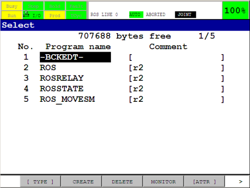

.. keywords = Fanuc, Roboguide, Industrial, R-30iB, R-30iA, R-J3iC, KAREL, TP

Installation of the driver
==========================

.. important::

   This tutorial assumes familiarity with Fanuc controller cabinets, the Teach Pendant (iPendant) and the Roboguide environment. For more information on any of the steps in this tutorial, consult the documentation on these subjects provided by Fanuc Robotics.

Overview
--------

This tutorial guides you through all the steps necessary to install the ROS-Industrial driver programs onto a Fanuc Robotics controller. After installation, the programs and controller will need to be configured, which will be described in :doc:`configuration`.

All of the steps outlined in this tutorial can be used for setting up a real controller as well as a simulated one in Roboguide. For a source install, the only difference is in the :ref:`sec-copying-the-binaries` step: Roboguide automatically loads the binaries onto the virtual robot controller as part of the build process, so no additional action is needed. For a binary install, the copy destination is the virtual controller instead of the real one.

Note that these tutorials only cover the installation and setup of those programs of the `fanuc_driver`_ package that are supposed to run on the controller. For help on installing ROS-Industrial in general, please see the ROS-Industrial `installation <http://wiki.ros.org/Industrial/Install>`_ pages.

Finally: this tutorial assumes the use of an *iPendant*. For users with older (legacy) pendants, this may mean that key sequences given in the text, screenshots and menus will not match completely. Due to the lower resolution of legacy pendants, many key sequences need either an additional ``NEXT`` inserted, or (sub)menus should be opened using ``TYPE``.

Installation options
--------------------

There are two options for installation: from source or using a set of precompiled binaries. In general, a binary install is recommended, as it is much faster and less involved (note: there are currently no KAREL binaries available for the Indigo version of the driver, thus a source install is always necessary for that version). After choosing a compatible version, only a small number of files have to be copied to the controller.

If it is not possible to use the provided binaries, a source install is the only option. This may be the case if the target controller runs an incompatible version of the KAREL runtime, if it cannot support access to *KAREL Vars* or if there is a requirement to use customised driver code. A source install is more complicated, as it necessitates the creation of a Roboguide workcell, and the compilation of several source files.

The same configuration procedure is used for both installation types.

Prerequisites
-------------

For a binary install, the following is needed:

 * a compatible binary distribution of the KAREL and TP binaries [#]_
 * a method of transferring the necessary files to the controller (USB stick, a network connection)

For a source installation, requirements are:

 * a copy of the `fanuc_driver`_ package, version 0.2 or newer
 * an installation of Fanuc Roboguide [#]_
 * a Windows PC or VM (as Roboguide does not run on Linux)
 * a method of transferring the necessary files to the controller (USB stick, a network connection)

In all cases, the following software options should be present on your robot in addition to basic networking and TCP/IP support:

 * R632 - KAREL
 * R648 - User Socket Messaging

Information on the installed software options can be found by consulting the documentation that came with your robot. Alternatively, the *Version ID* submenu of the *STATUS* screen can be used. On the TP: ``Menu → NEXT → STATUS → Version ID``, then ``CONFIG`` (or ``F3``). The same information is available on the *Summary Configuration/Status* webpage, which should be accessible if your controller has the web server option installed.

.. important::

   Make sure your controller has a correctly configured and working network setup. Verify you can *ping* the controller from your ROS pc. Refer to the relevant documentation for instructions on how to configure networking on a Fanuc industrial robot controller.

If you've chosen to perform an installation using the precompiled binaries, please proceed to the :ref:`sec-binary-install` section. For an installation from source, continue with the next section.

Source Install
--------------

Before the ROS-Industrial programs can be transferred to the robot controller, they need to be compiled into binaries. We'll use Fanuc Roboguide for this.

Creating a Workcell
^^^^^^^^^^^^^^^^^^^

First, create a new workcell in Roboguide, either by using the wizard or by creating a copy from your actual robot controller. When using the wizard, be sure to select the correct *Application* package, as well as the correct robot type. On the software options screen, also make sure to select at least options *R632 - KAREL* and *R648 - User Socket Messaging*.

.. figure:: _static/rg_cellwiz_karel_usm.png
   :width: 100%
   :align: center
   :figclass: align-centered
   :alt: New workcell wizard: KAREL and USM options

After completing the wizard, you should end up with an empty workcell with just your robot in the middle of it. If you chose to create a copy of the controller, the *Cell Browser* might show programs and files that were already present on the robot under the *Programs* and *Files* sections. As long as they do not conflict with the ROS-Industrial KAREL programs, they can be ignored.

.. _sec-importing:

Importing
^^^^^^^^^

.. http://stackoverflow.com/questions/4550021/working-example-of-floating-image-in-restructured-text

.. |clearfloat|  raw:: html

    

.. figure:: _static/rg_file_list.png
   :align: right
   :figclass: align-right
   :alt: ROS-Industrial Karel and TPE programs in the Files section of the Cell Browser

|clearfloat|

In the *Cell Browser*, import the KAREL and TPE sources into the workcell using the ``Project → Add Files`` menu option. Browse to your local `fanuc_driver`_ package and select all ``*.kl`` files in the ``karel`` sub directory not ending in ``_h.kl`` or ``_t.kl``.

For `fanuc_driver`_ version 0.3.0 and up, just select all ``.kl`` files in the ``karel`` sub directory.

Click the ``Open`` button to add them to the *Cell Browser*.

Now add the ``*.ls`` files in the ``tpe`` sub directory as well. The *Files* section in the *Cell Browser* should contain at least the files shown.

.. _sec-building:

Building
^^^^^^^^

|clearfloat|

Now build all files by selecting ``Project → Build → All`` in Roboguide (if you have other source files under *Files*, build only those shown in the :ref:`sec-importing` section). No errors or warnings should be reported, and the *Programs* section in the *Cell Browser* should show the compiled binaries (``TPREC`` is a default program and is not a part of ROS-Industrial).

Now continue with :ref:`sec-copying-the-binaries`.

.. raw:: html

   

.. _sec-binary-install:

Binary Install
--------------

A Roboguide workcell is not needed for a binary install: all that is required is a copy of the necessary binaries. They should be compatible with the software installed on the target controller, as well as with the installed version of `fanuc_driver`_ (so version 0.2.0 of `fanuc_driver`_ must be used with version 0.2.0 of the precompiled binaries).

From the `Binaries <http://wiki.ros.org/fanuc_driver/hydro#Binaries>`_ section on the `fanuc_driver`_ page, download the correct version and extract it in some temporary location. You should end up with a directory containing several ``.pc`` and ``.tp`` files. Make sure the names correspond to those listed in the :ref:`sec-building` section.

We can now continue to copy the extracted files to the target controller.

.. _sec-copying-the-binaries:

Copying the Binaries
--------------------

Finally, the binaries need to be transferred to the controller. This can be done by direct transfer over a network connection (FTP) or by using a mass storage device (such as a USB stick or PCMCIA memory card). Refer to the relevant Fanuc Operator's Manual for the tool package installed on the robot controller for information on how to copy files using removable media [#]_. Refer to the Roboguide help files for information on how to perform network transfers of files to robots [#]_.

.. note::

   Updating older versions of the ROS-Industrial KAREL programs may result in a ``MEMO-159`` or ``VARS-014`` error. See `MEMO-159: Convert failed in PROG <http://wiki.ros.org/fanuc_driver/Troubleshooting#MEMO-159:_Convert_failed_in_PROG>`_ in that case. TP programs are always overwritable, provided none of them are loaded as the *current* program (ie: loaded through the *Program Select* window).

After copying the binaries onto the robot controller, open the *Program Select* window by pressing the ``Select`` button on the TP, then ``[TYPE] → KAREL Progs``.

If the KAREL programs do not show up on the TP, or you cannot change the display ``TYPE`` to ``KAREL Progs``, make sure the KAREL support has been properly setup on your controller. See `KAREL programs are invisible on the Program Select window <http://wiki.ros.org/fanuc_driver/Troubleshooting#KAREL_programs_are_invisible_on_the_Program_Select_window>`_ on the `Troubleshooting <http://wiki.ros.org/fanuc_driver/Troubleshooting>`_ page.

Make sure the following programs are listed (note that the revision numbers may be different):

Also check to make sure the necessary TPE programs are present by pressing ``[TYPE] → TP Programs``. You should see the following programs (the ``-BCKEDT-`` program is not part of ROS-Industrial):

The ROS-Industrial programs are now installed on the controller.

Next
----

Now that the necessary libraries and programs have been installed they need to be configured. We will do this in :doc:`configuration`.

.. Notes
.. -----

.. rubric:: Footnotes

.. [#] There is a certain amount of backward compatibility in KAREL, so it may be possible to use the provided binaries, even though the runtime version specified does not match that of the controller. The TP programs do not use any non-standard options, so they should be compatible with most controllers.

.. [#] As an alternative to Roboguide, WinOLPC / OlpcPRO or even the KCL console could be used to compile the KAREL sources into p-code binaries. These alternatives are not documented in this tutorial, and only the use of Roboguide is described.

.. [#] For Fanuc's Handling Tool, this would be Chapter 8 of the *FANUC Robot Series, R-30iA, Handling Tool, Operator's Manual*, document *B-82594EN-2/02*.

.. [#] If you're setting up a virtual controller, FTP to ``localhost`` can be used, or you can copy the binaries to the ``Robot_N\MC`` directory (where ``N`` is the number of the robot controller). This directory is a sub directory of the workcell directory under ``My Workcells``. For a workcell named *ROS-I Test*, this directory would by default be at ``%USERPROFILE%\(My) Documents\My Workcells\ROS-I Test\Robot_N\MC``.

.. Links

.. _fanuc_driver: http://wiki.ros.org/fanuc_driver
